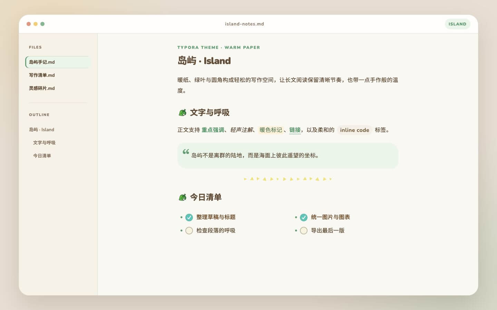

# Typora Themes

个人维护的 Typora 主题集合。仓库采用一个主题一个文件夹的组织方式，方便主题独立安装、维护和分发。

## 主题

| 主题 | 状态 | 简介 |
| --- | --- | --- |
| [岛屿（Island）](./island/) | 可用 | 基于并改编自 `animal-island-ui` 的暖色岛屿风格。 |

## 预览

## 安装

1. 在 Typora 中打开“偏好设置 → 外观 → 打开主题文件夹”。
2. 进入所选主题的文件夹，按照该主题 README 的说明复制 CSS、字体和资源文件。
3. 重启 Typora，在“主题”菜单中选择对应主题。

## 目录约定

每个一级子目录对应一个独立主题，并包含该主题的 CSS、配套资源、测试文档、安装说明及必要的许可文件。

## 许可

不同主题可能采用不同的来源、字体和资源许可证。使用、修改或分发前，请查看对应主题目录中的 README 和许可文件。

岛屿主题包含来自 `animal-island-ui` 的改编内容，仅限非商业用途；具体署名和许可说明见 [岛屿主题 README](./island/README.md#许可与署名)。

## 制作工具

本仓库中的主题使用 [inexistence/typora-theme-skill](https://github.com/inexistence/typora-theme-skill) 辅助创建和调试。安装或使用主题不需要安装该 Skill。
