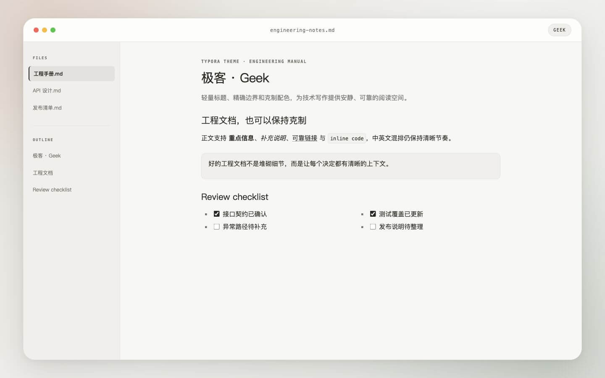
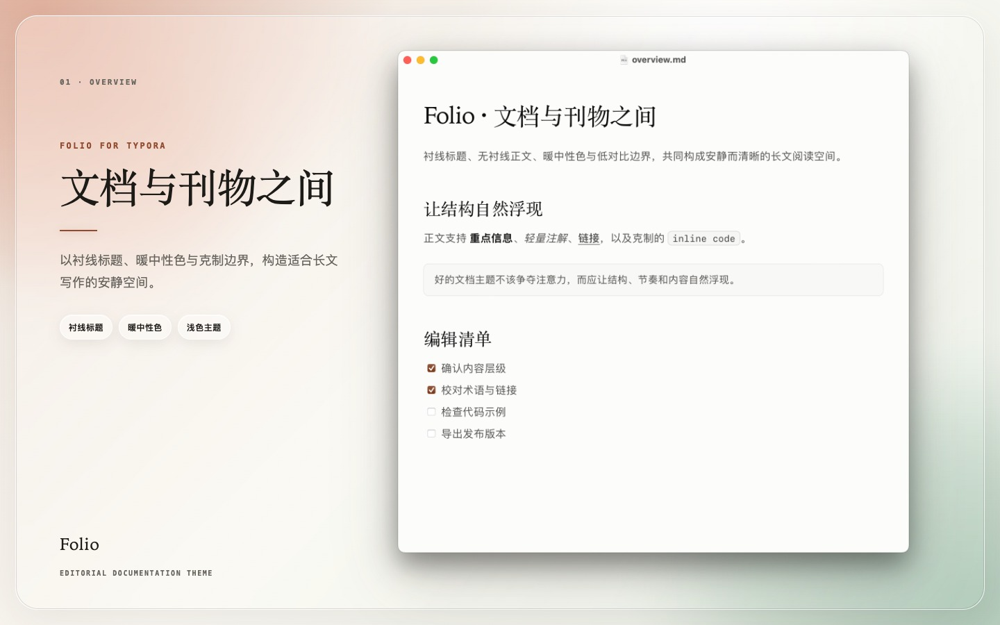

# Typora Themes

个人维护的 Typora 主题集合。仓库采用一个主题一个文件夹的组织方式，方便主题独立安装、维护和分发。

## 主题

| 主题 | 状态 | 简介 |
| --- | --- | --- |
| [岛屿（Island）](./island/) | 可用 | 基于并改编自 `animal-island-ui` 的暖色岛屿风格。 |
| [极客（Geek）](./geek/) | 可用 | 参考 Cursor Docs、同时提供浅色与深色版本的工程文档风格。 |
| [书页（Folio）](./folio/) | 可用 | 参考 Claude Platform Docs 的浅色与深色编辑刊物风格，含实验性的轻量代码标签组增强器。 |
| [晴窗（Sunlit）](./sunlit/) | 原型 | 暖象牙纸面与动态枝叶投影；当前视频素材仅供本地效果验证。 |
| [Cupertino](./cupertino/) | 可用 | 参考 Apple 人机界面指南按钮层级的系统化文档主题，提供浅色与深色版本。 |

## 预览

### 岛屿


### 极客



### 书页



### 晴窗

https://github.com/user-attachments/assets/af6ed57f-fd3c-42a7-8372-1f009121bf87

## 安装

本节是仓库唯一的安装说明。执行安装、卸载或恢复前，请先完全退出 Typora。

### macOS 统一安装器

在仓库根目录运行：

```bash
./install-macos.sh list
./install-macos.sh --dry-run install all
./install-macos.sh install all
```

可用主题名为 `island`、`geek`、`folio`、`sunlit`、`cupertino` 和 `all`。也可以单独管理主题：

```bash
./install-macos.sh install folio
./install-macos.sh uninstall sunlit
```

`list` 和 `--dry-run` 不会写入文件。所有带增强模块的主题共用一个运行时入口；安装器会自动迁移旧的独立增强器标签，并在最后一个增强主题卸载后移除共享运行时。

### macOS 权限

若 `/Applications/Typora.app` 不可写，请在交互式 macOS Terminal 中运行。脚本只会在原子替换 Typora 的 `index.html` 时单独请求管理员密码；不要使用 `sudo ./install-macos.sh`。

如果出现 `Operation not permitted`，请在“系统设置 → 隐私与安全性 → 应用管理”中允许当前终端更新其他应用，然后重新运行。

### 备份与恢复

每次安装、卸载和恢复前，脚本都会创建快照：

```text
~/Library/Application Support/abnerworks.Typora/typora-themes-install-backups/
```

恢复最近一次操作前的状态：

```bash
./install-macos.sh --dry-run restore latest
./install-macos.sh restore latest
```

也可以传入操作结束时显示的快照名称。恢复会校验文件哈希；如果安装后文件又被修改，脚本会停止，只有确认覆盖这些修改时才使用 `--force`。

旧版 `folio-install-backups` 和 `sunlit-install-backups` 目录不会被删除。

### 手动安装

如果不希望修改 Typora.app，可在 Typora 中打开“偏好设置 → 外观 → 打开主题文件夹”，从仓库复制以下文件：

| 主题 | 复制内容 | 手动安装效果 |
| --- | --- | --- |
| Island | `island/island.css`、`island/island/` | 完整静态主题与本地资源 |
| Geek | `geek/geek.css`、`geek/geek-dark.css`、`geek/geek/` | Geek 与 Geek Dark |
| Folio | `folio/folio.css`、`folio/folio-dark.css` | 不启用实验性代码标签组 |
| Sunlit | `sunlit/sunlit.css`、`sunlit/sunlit/` | 使用静态树影，不播放视频 |
| Cupertino | `cupertino/cupertino.css`、`cupertino/cupertino-dark.css`、`cupertino/cupertino/` | Cupertino 与 Cupertino Dark |

复制后重启 Typora，并在“主题”菜单中选择对应主题。Geek Dark、Folio Dark 和 Cupertino Dark 分别依赖同级的浅色 CSS 文件。

## 目录约定

每个一级子目录对应一个独立主题，并包含该主题的 CSS、配套资源、主题说明及必要的许可文件。主题专属测试文档可以保留特殊场景；完整语法和通用视觉回归统一使用根目录的 [`theme-test.md`](./theme-test.md)。

根目录 `themes.plist` 是唯一主题注册表；统一安装器从中生成主题列表、受管路径和增强模块映射。

`runtime/` 只保存所有增强主题共用的生命周期管理器；各模块放在对应主题的资源目录。Typora 入口只注入一份 `typora-themes-runtime.js`，切换主题时由它负责挂载和销毁对应模块。

## 开发

新增主题、主题资源或增强模块前，请阅读[开发规范](./DEVELOPMENT.md)。增强系统的启动、主题识别、异步加载、生命周期和调试方法见[增强模块技术原理](./runtime/ARCHITECTURE.md)。

开发或修改主题后，在 Typora 中应用主题并打开[统一主题验收文档](./theme-test.md)，按文末清单检查完整 Markdown、Typora 扩展语法、编辑状态和导出效果。

可以使用仓库内的主题脚手架快速创建标准目录，并管理安装包中的主题：

以下命令中的 `paper-note` 是自定义的主题 ID，`Paper Note` 是对应的显示名称；请替换为你的主题信息，并在后续命令中保持一致。

```bash
./theme-scaffold.sh create paper-note --name "Paper Note" --dark
./theme-scaffold.sh list
./theme-scaffold.sh publish paper-note --name "Paper Note"
./theme-scaffold.sh unpublish paper-note
```

`create` 默认创建未上架的本地草稿；`publish` 校验必需文件后写入 `themes.plist`；`unpublish` 只移除安装包登记，不删除本地主题文件。完整选项见 `./theme-scaffold.sh --help`。

## 许可

不同主题可能采用不同的来源、字体和资源许可证。使用、修改或分发前，请查看对应主题目录中的 README 和许可文件。

岛屿主题包含来自 `animal-island-ui` 的改编内容，仅限非商业用途；具体署名和许可说明见 [岛屿主题 README](./island/README.md#许可与署名)。

Sunlit 主题的树影视频暂时取自 [dany.works](https://dany.works/leaves.mp4)，仅用于本地设计验证；本仓库未获得该素材的再分发许可，公开发布、打包或商业使用前必须替换为自行制作或具有明确授权的素材。详见 [Sunlit 主题 README](./sunlit/README.md#原型素材说明)。

## 制作工具

本仓库中的主题使用 [inexistence/typora-theme-skill](https://github.com/inexistence/typora-theme-skill) 辅助创建和调试。安装或使用主题不需要安装该 Skill。
