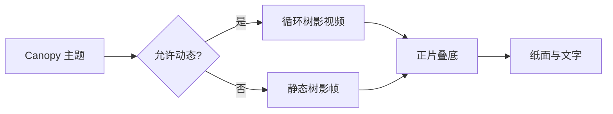

# 林冠之下

Canopy 将上海此刻的季节天光、太阳位置和枝叶投影覆盖到整个 Typora 窗口。它会从春日青绿、盛夏冷白、秋日琥珀一路进入冬夜银蓝，文字也处在光影之中。

## 正文与强调

这里同时测试 **粗体文字**、*斜体文字*、~~删除内容~~、`行内代码`、[链接](https://typora.io/) 和 ==高亮文本==。光场和树影应覆盖字形，但不能拦截选择、输入和滚动。

> 在 Canopy 中，树影不是背景装饰，而是写作空间本身的一部分。

### 列表与任务

- 日期驱动的四季颜色
- 上海日出日落与完整昼夜
- 覆盖侧栏和字形的连续枝叶运动

1. 检查文字中心区域的对比度。
2. 检查树影经过标题时是否仍然易读。
3. 检查滚动、选字和输入是否顺畅。

- [x] 静态树影降级
- [ ] 替换为具有明确授权的正式素材

## 表格

| 状态 | 树影 | 行为 |
| --- | --- | --- |
| Canopy 启用 | 实时光场＋视频 | 按上海日期和时刻自动变化 |
| 减少动态 | 静态帧 | 不播放视频 |
| 窗口隐藏 | 暂停 | 返回后继续 |
| 打印或导出 | 无 | 保持正文干净 |

## 演示时间轴

在开发者工具 Console 中执行 `window.__canopyDebug.show()`，确认日期选择、时间滑杆、播放/暂停、速度切换、恢复实时和隐藏控件均可用。隐藏 HUD 后，自动时间轴应继续推进，方便录制无控件的演示画面。

## 代码

```css
#canopy-leaves-overlay {
  position: fixed;
  inset: 0;
  object-fit: cover;
  mix-blend-mode: multiply;
  pointer-events: none;
}
```

```javascript
const atmosphere = 'a year of light beneath the canopy'
console.log(atmosphere)
```

## 数学与图表

光照强度可以简单写成 $I(t)=I_0+\epsilon(t)$，其中 $\epsilon(t)$ 是缓慢变化的小扰动。

$$
L_{final}=L_{paper}\times L_{shadow}
$$



---

最后一段用于检查长文末尾、滚动位置和树影覆盖是否稳定。切换到其他主题后，视频应立即淡出并暂停。
