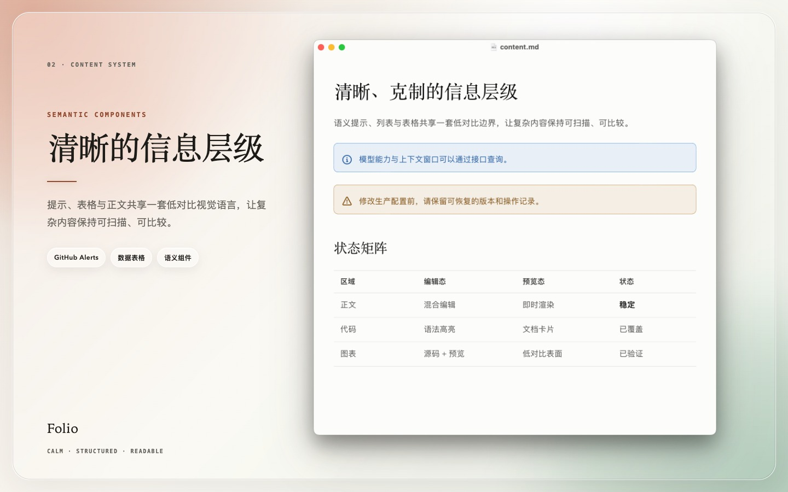
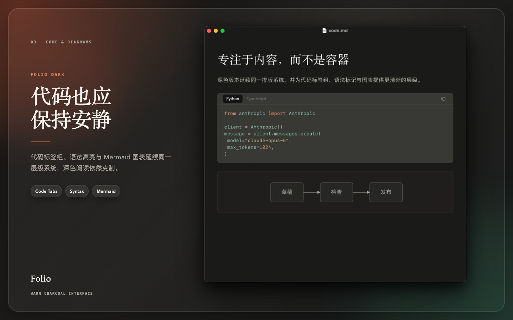

# Folio

Folio 是一套介于产品文档与编辑刊物之间的 Typora 主题，提供独立的浅色与深色版本。

它参考 Claude Platform Docs 的视觉语言：衬线标题、无衬线正文、暖中性色、低对比边界和克制的代码组件。主题没有复制或打包 Anthropic 的字体、图片或源 CSS。

## 预览






## 文件

- `folio.css`：暖白浅色版本。
- `folio-dark.css`：暖灰黑深色版本，通过导入 `folio.css` 复用排版与编辑状态规则。
- `folio/folio-module.js`：由共享运行时按需加载的实验性代码标签组模块。
- `folio-test.md`：覆盖排版、代码、图表、图片和 Typora 状态的测试文档。
- `preview/`：用于 README 展示的 1440 × 900 主题效果图。
- `preview-source/`：用于在 Typora 中拍摄真实主题效果的预览文档和截图说明。

## 视觉系统

- 一级至三级标题使用系统衬线字体栈；正文与较低级标题使用系统无衬线字体栈。
- 浅色版以 `#fcfcfb` 为纸张底色，正文使用低饱和暖灰。
- 深色版使用 `#141413`、`#1f1e1d`、`#262624` 和 `#30302e` 构成四级表面。
- 陶土色仅用于链接交互、任务控件、光标、选择和少量强调。
- 表格以水平分隔为主；普通代码围栏使用轻边框、8px 圆角、简洁语言栏和 14/20px 等宽正文。
- 单个代码块与代码标签组共用同一套卡片、语言栏、语法高亮及聚焦样式。

## 引用与语义提示框

普通 Markdown 引用使用中性背景、0.5px 边框、8px 圆角和紧凑内边距，适合长文中的引述及嵌套引用。它不会自动添加图标或状态颜色。

Typora 的 GitHub Alert 语法会显示为 Claude Docs 风格的语义提示框，支持 `NOTE`、`TIP`、`IMPORTANT`、`WARNING` 和 `CAUTION`：

```markdown
> [!NOTE]
> 这是一条信息说明。

> [!TIP]
> 这是一条使用建议。
```

提示框使用 Typora 自带的语义图标：Note 为蓝色，Tip 为中性表面，Important 为紫色，Warning 为琥珀色，Caution 为红色。浅色与深色主题分别提供对应背景、边框和文字颜色，不依赖 Folio Enhancer。

## 实验性功能：代码标签组

> **实验性功能：** Folio 模块依赖 Typora 当前的内部 DOM 结构，并非 Typora 官方插件 API。Typora 更新后可能暂时失效，需要重新安装或调整模块。重要文档应始终以不启用增强功能也能正常阅读为前提。

Folio 使用 Markdown 引用作为代码组容器。一个引用中直接包含两个或更多普通围栏代码块时，增强器会把它们显示成可点击的 `Python / TypeScript / …` 标签页：

````markdown
> ```python
> model = "claude-opus-5"
> ```
>
> ```typescript
> const model = "claude-opus-5";
> ```
````

标签组支持鼠标点击、左右方向键、Home、End 和复制当前代码。增强器也会在普通单代码块的语言栏右侧加入同款复制按钮；未安装增强器时不会生成按钮。点击标签组的代码正文进入编辑状态后，左下角会显示紧凑的 Typora 原生语言输入框；它不创建全宽底栏，离开代码块后控件和占位会一起收起。输入后按 Enter、Escape 或点击别处，顶部 Tab 名称会随之刷新。Mermaid 等高级围栏不会被加入标签组。

这个 Markdown 写法不依赖增强器。在未安装增强器、增强器失效、切换到其他主题或导出打印时，各代码块会安全降级为普通的纵向代码块，不会变成横向画廊，也不会损失内容。

Folio 模块和共享运行时都是无依赖的本地脚本，没有包管理器、网络请求或全局插件样式。运行时读取 Folio CSS 中的主题标记，只在 Folio 激活时挂载代码块观察器和事件监听；切换主题后会立即清理生成的 UI。

Typora 官方说明将编辑器外观自定义放在[主题 CSS](https://support.typora.io/Add-Custom-CSS/)中，而 JavaScript 注入记录在[导出功能](https://support.typora.io/Export/)中；没有可供编辑器标签交互使用的官方扩展入口。因此统一安装器仍需向 Typora 应用的 `index.html` 加入一个共享运行时标签，这也是该功能被标记为实验性的原因。

## 安装

自动安装、手动安装、权限处理、卸载和恢复方式统一见[仓库安装说明](../README.md#安装)。手动安装 Folio 时不会启用实验性代码标签组，代码块会保持普通的纵向显示。

## 验证建议

使用 `folio-test.md` 分别检查：

- 混合编辑与源码模式中的 Markdown 元字符；
- 普通代码围栏的插入光标、当前行、选择与语法颜色；
- 单个代码块与标签组中的代码块样式一致；
- 标签切换、键盘导航、复制按钮及未安装增强器时的纵向显示；
- Mermaid 未聚焦预览与聚焦编辑状态；
- 数学公式、目录、脚注和 YAML front matter；
- 浅色、深色、专注模式、侧栏、弹窗、窄窗口和 PDF 导出。

主题已通过仓库的静态选择器检查，但代码标签组仍应在目标 Typora 版本中完成人工验证。
