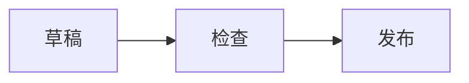

# 专注于内容，而不是容器

深色版本延续同一排版系统，并为代码标签组、语法标记与图表提供更清晰的层级。

> ```python
> from anthropic import Anthropic
>
> client = Anthropic()
> message = client.messages.create(
>     model="claude-opus-5",
>     max_tokens=1024,
> )
> ```
>
> ```typescript
> import Anthropic from "@anthropic-ai/sdk";
>
> const client = new Anthropic();
> const message = await client.messages.create({
>   model: "claude-opus-5",
>   max_tokens: 1024,
> });
> ```


