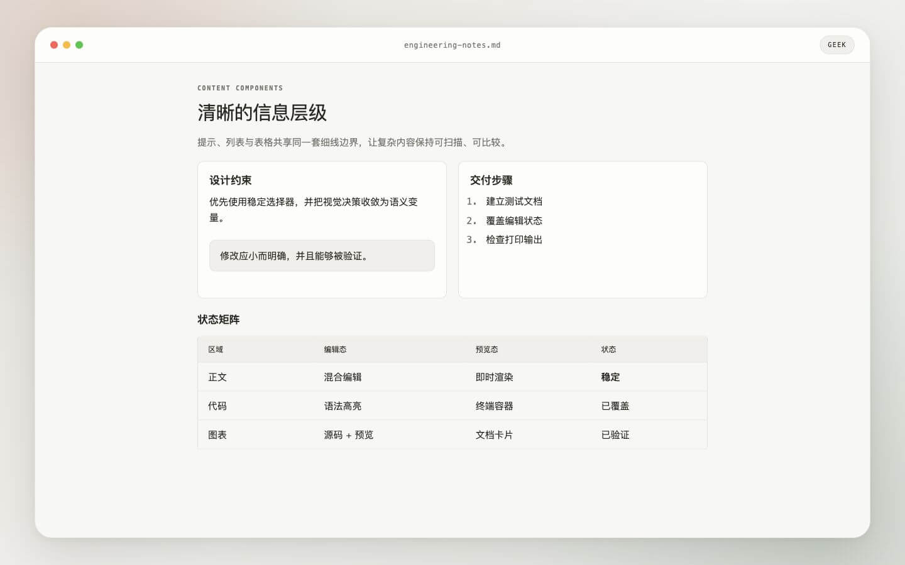
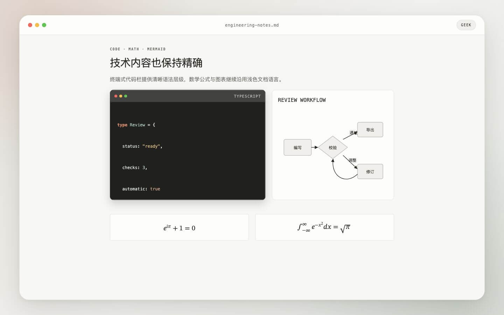

# 极客 Typora 主题

一款克制、简洁的工程文档主题，采用轻量标题、提示卡片、方形列表、终端风格代码块和细线表格，并完整适配 Typora 的混合编辑、源码模式、专注模式、侧栏、弹窗与打印状态。主题同时提供浅色 `Geek` 与深色 `Geek Dark` 两个版本。

## 预览

## 视觉特征

- `#f7f7f4` 浅灰纸张与 `#26251e` 暖黑正文，保持克制的单色工程文档气质。
- `Geek Dark` 参考 [Cursor Docs](https://cursor.com/cn/docs/agent/agent-review) 的暖色深色界面，采用 `#14120b` 背景、`#edecec` 正文、`#1b1913` 卡片和 `#2a2822` 边界。
- 一级、二级标题使用常规字重和紧凑字距，三级以下逐步增强字重。
- 引用使用低对比提示卡片；表格采用细边界、等宽表头和可横向滚动的宽内容布局。
- 代码块采用深色终端容器，包含三色窗口控制点、语言标签和暖色语法高亮。
- 不依赖远程字体或图片资源，离线安装即可使用。

## 文件

- `geek.css`：浅色 `Geek` 主题，也是两个版本共享的完整基础样式。
- `geek-dark.css`：深色 `Geek Dark` 主题，通过本地导入复用 `geek.css`，不依赖网络资源。
- `geek-test.md`：覆盖标题、引用、列表、任务、表格、代码、数学公式、Mermaid、脚注和打印的测试文档。
- `preview/`：用于 README 展示的 1440 × 900 主题效果图。
- `preview-source/`：用于在 Typora 中拍摄真实主题效果的预览文档和截图说明。

脚手架生成的 `geek/` 资源目录当前为空，是为未来的本地字体或图片资源保留的标准主题目录。

## 安装

自动安装、手动安装、卸载和恢复方式统一见[仓库安装说明](../README.md#安装)。

`geek-dark.css` 会从同级目录导入 `geek.css`，因此使用深色版本时两个 CSS 文件必须保持在同一目录。

## Typora 适配

主题针对桌面编辑环境实现了代码围栏、源码模式、Markdown 元字符、TOC、脚注、数学公式、图表、侧栏、搜索和打印样式。
