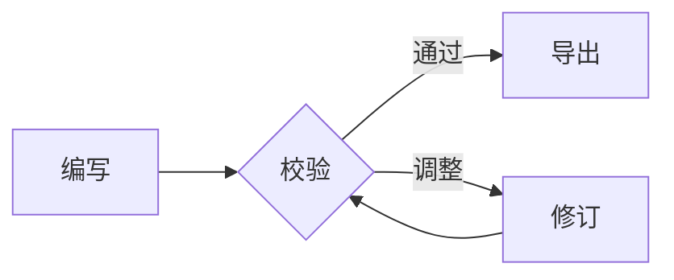

# 极客 · Geek

这份文档用于检查“极客”主题在混合编辑、源码模式、专注模式和打印/PDF 导出中的表现。

浅灰纸张、轻量标题、细线边界与终端代码块构成了这套主题的工程文档气质。正文刻意保持克制，请同时留意中英文混排和长技术标识符的换行表现。

## Typography

This paragraph includes **bold**, *emphasis*, ***bold emphasis***, ~~deleted text~~, ==highlighted text==, `inline code`, H~2~O, x^2^, a [link](https://typora.io), and a footnote.[^1]

### Heading level three

#### Heading level four

##### Heading level five

###### Heading level six

> 工程文档的提示卡片应清晰但不喧宾夺主；多行内容也要保留稳定的阅读节奏。
>
> > Nested quotations should have a visible but restrained hierarchy.

---

## Lists and tasks

- Unordered item
  - Nested item
    - Third level
- Item with a longer line to exercise wrapping and indentation in a narrow window.

1. Ordered item
2. Another item
   1. Nested ordered item

- [x] 已完成：确认视觉令牌
- [ ] 待完成：在 Typora 中检查全部交互状态

## Table

| Element | State | Notes |
| --- | ---: | --- |
| Heading | 6 levels | Check spacing and hierarchy |
| Code | Inline + fence | Check terminal frame and syntax tokens |
| Export | PDF / print | Check wrapping and page breaks |

## Code

```javascript
interface Result<T> {
  ok: boolean;
  value: T;
}

async function buildTheme(name) {
  const result = await compile(name); // Inspect comment contrast.
  return { ok: true, value: result } satisfies Result<string>;
}
```

```bash
#!/usr/bin/env bash
theme_name="geek"
python3 validate_theme.py "${theme_name}.css" --verbose
```

```css
:root {
  --paper: #f7f7f4;
  --ink: #26251e;
}
```

## Math and diagrams

Inline math: $e^{i\pi} + 1 = 0$.

$$
\int_{-\infty}^{\infty} e^{-x^2}\,dx = \sqrt{\pi}
$$



## Media and long content


Long token for overflow testing: `https://example.com/a/very/long/path/that/should/not/destroy/the-writing-area-layout-or-overflow-controls`.

[^1]: Footnote definitions and their editing states need styling too.
