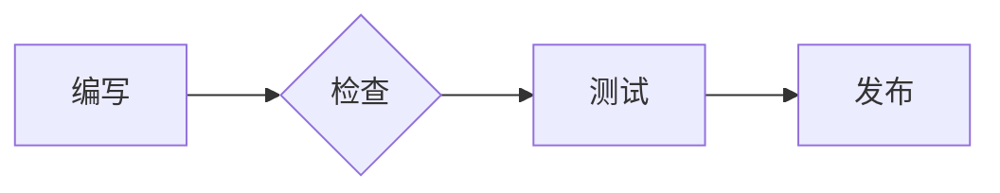

# 让实现保持可读

终端式代码容器、精确语法颜色和低对比图表，为工程文档提供稳定的视觉锚点。

```typescript
interface BuildResult {
  ok: boolean;
  output: string;
}

const result = await buildTheme("geek");
console.log(result.output);
```


