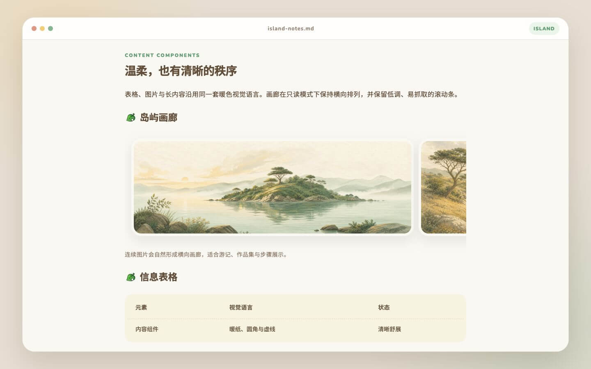
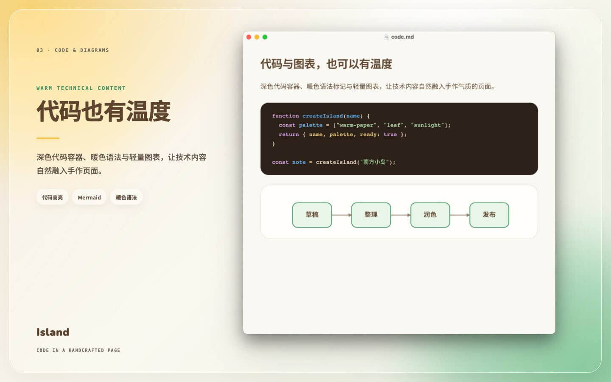

# 岛屿 Typora 主题

从 `animal-island-ui` 的样式同步而来，参考：暖纸背景、棕色正文、原版叶片标题图标、Divider `line-yellow` 分割线、Checkbox 任务项、Tag `soft` 行内代码、圆角引用、暖色表格以及 CodeBlock 容器与高亮色板。

## 预览

## 文件

- `island.css`：可安装的完整 Typora 主题。
- `island-test.md`：覆盖标题、引用、列表、表格、代码、数学公式、图表和打印的测试文档。
- `island/fonts/`：与 `animal-island-ui` 对齐的 Nunito 与 Noto Sans SC 本地字体及许可证。
- `island/assets/`：主题专属视觉资源；分割线使用 Divider 组件的 `line-yellow` 原始 SVG。
- `preview/`：用于 README 展示的主题效果图。
- `preview-source/`：用于在 Typora 中拍摄真实主题效果的预览文档和截图说明。

## 安装

自动安装、手动安装、卸载和恢复方式统一见[仓库安装说明](../README.md#安装)。

字体栈与最初参考 `animal-island-ui` 保持一致：拉丁字符优先使用 Nunito，中文使用 Noto Sans SC，并回退到系统中文无衬线字体。

## 许可与署名

本主题基于并改编自 [animal-island-ui](https://github.com/guokaigdg/animal-island-ui)，原作者为 [guokaigdg](https://github.com/guokaigdg)。主题包含对其视觉样式的改编，并使用或改编了部分图标与组件视觉资源。

`animal-island-ui` 及相关改编部分依据 [CC BY-NC 4.0](https://creativecommons.org/licenses/by-nc/4.0/) 使用：仅限非商业用途；转载或再分发时须保留本署名、来源和许可证链接，并注明内容已经修改。

本主题与 `animal-island-ui` 原作者不存在官方关联或背书关系。

字体文件适用各自的 SIL Open Font License 1.1，详见 `island/fonts/OFL-1.1.txt`；视觉资源许可全文见 `island/assets/CC-BY-NC-4.0.txt`。
