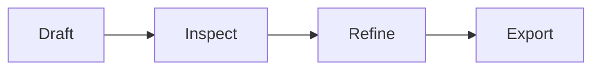

# 岛屿 · Island

这份文档用于检查“岛屿”主题在混合编辑、源码模式、专注模式和打印/PDF 导出中的表现。

暖纸、叶片、圆角与黄色线条分隔共同构成了这套主题的手作气质，也请留意中文正文在长段落中的阅读节奏。

## Typography

This paragraph includes **bold**, *emphasis*, ***bold emphasis***, ~~deleted text~~, ==highlighted text==, `inline code`, H~2~O, x^2^, a [link](https://typora.io), and a footnote.[^1]

### Heading level three

#### Heading level four

##### Heading level five

###### Heading level six

> 岛屿不是离群的陆地，而是海面上彼此遥望的坐标。引用块应在多行文字下仍然清晰、轻盈。
>
> > Nested quotations should have clear hierarchy.

---

## Lists and tasks

- Unordered item
  - Nested item
    - Third level
- Item with a longer line to exercise wrapping and indentation in a narrow window.

1. Ordered item
2. Another item
   1. Nested ordered item

- [x] Completed task
- [ ] Incomplete task

## Table

| Element | State | Notes |
| --- | ---: | --- |
| Heading | 6 levels | Check spacing and hierarchy |
| Code | Inline + fence | Check syntax tokens |
| Export | PDF / print | Check page breaks |

## Code

```javascript
function greet(name) {
  const message = `Hello, ${name}!`;
  console.log(message); // Inspect comment contrast.
  return { ok: true, message };
}
```

```css
:root {
  --accent: #4f9f70;
}
```

## Math and diagrams

Inline math: $e^{i\pi} + 1 = 0$.

$$
\int_{-\infty}^{\infty} e^{-x^2}\,dx = \sqrt{\pi}
$$



## Media and long content


Long token for overflow testing: `https://example.com/a/very/long/path/that/should/not/destroy/the/writing-area-layout-or-overflow-controls`.

[^1]: Footnote definitions and their editing states need styling too.
