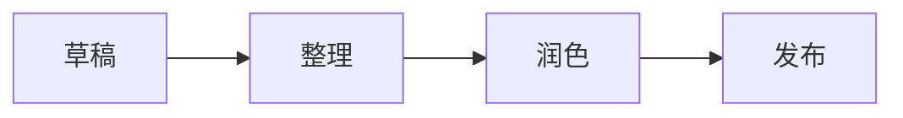

# 代码与图表，也可以有温度

深色代码容器、暖色语法标记与轻量图表，让技术内容自然融入手作气质的页面。

```javascript
function createIsland(name) {
  const palette = ["warm-paper", "leaf", "sunlight"];
  return { name, palette, ready: true };
}

const note = createIsland("南方小岛");
```


