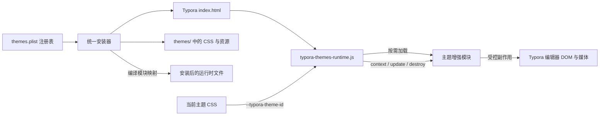
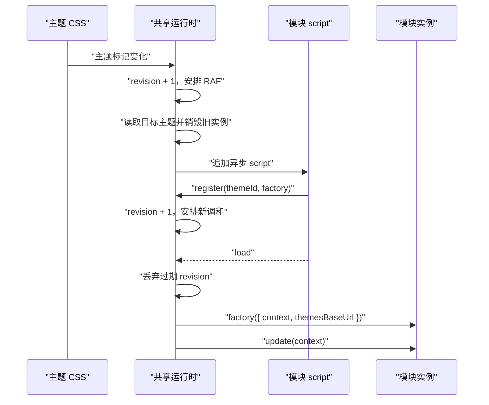

# 增强模块技术原理

本文说明 Typora Themes 增强系统的运行机制、生命周期、竞态处理和故障降级。新增模块的目录与接入步骤见[开发规范](../DEVELOPMENT.md#4-新增增强模块)。

## 1. 为什么需要共享运行时

Typora 主题原生以 CSS 为主，没有面向编辑区交互的稳定插件 API。CSS 可以完成排版、颜色和静态装饰，但无法可靠实现以下功能：

- 根据编辑器 DOM 变化生成代码标签页。
- 调用剪贴板或 CodeMirror 实例。
- 根据页面可见性和“减少动态”状态暂停视频。
- 在主题切换时创建和销毁带状态的交互功能。

如果每个主题各自向 Typora `index.html` 注入脚本，它们会同时常驻，分别监听主题变化，并可能在其他主题中继续修改 DOM。当前架构改为一个共享运行时入口，由它保证同一时刻最多只有一个主题增强实例。

这套系统不是 Typora 官方插件机制。它是一个本地、可降级、由主题 CSS 驱动的生命周期层。

## 2. 组件关系



各部分职责：

| 组件 | 职责 | 不负责 |
| --- | --- | --- |
| `themes.plist` | 声明主题 ID、CSS 文件名和可选增强模块文件名 | 执行安装或运行主题功能 |
| 统一安装器 | 解析注册表、复制文件、生成模块映射、维护唯一入口、备份与恢复 | 判断当前正在使用哪个主题 |
| 主题 CSS | 提供样式、主题 ID 和无 JavaScript 时的静态降级 | 创建长期运行的交互状态 |
| 共享运行时 | 识别主题、加载模块、管理唯一活动实例和全局上下文 | 实现具体主题功能 |
| 增强模块 | 在激活期间实现主题专属 DOM、交互或媒体效果 | 注入全局入口、管理其他主题 |

## 3. 文件布局与 URL 解析

仓库中的 `themes.plist` 是唯一主题注册表。CSS、资源和模块目录由主题 ID 与文件名约定推导，不在配置中重复路径。安装后关键文件位于：

```text
themes/
├── typora-themes-runtime.js
├── folio.css
├── folio/
│   └── folio-module.js
├── sunlit.css
└── sunlit/
    ├── sunlit-module.js
    └── assets/
        └── leaves.mp4
```

运行时通过 `document.currentScript.src` 获取自身 URL，再用 `new URL('.', scriptUrl)` 计算 `themesBaseUrl`。因此模块和素材都使用相对 URL，不依赖用户名或固定用户数据目录：

```js
new URL('sunlit/sunlit-module.js', themesBaseUrl)
new URL('sunlit/assets/leaves.mp4', themesBaseUrl)
```

安装器从 `themes.plist` 中所有非空的 `module` 字段生成模块映射，并把它作为同一文件的配置前缀写入安装后的 `typora-themes-runtime.js`：

```js
window[Symbol.for('typora-themes-runtime-config@1')] = Object.freeze({
  folio: 'folio/folio-module.js',
  sunlit: 'sunlit/sunlit-module.js',
})
```

正常模块允许列表不在运行时源码中硬编码。启动后，运行时复制并冻结安装器生成的配置作为 `moduleFiles`。源码中出现的 Folio、Sunlit ID 仅用于兼容旧版 CSS 标记。`moduleFiles` 同时承担允许列表作用；CSS 中出现未知主题 ID 时，运行时不会拼接并加载任意路径。

## 4. 启动过程

统一安装器只向 Typora 入口加入一份脚本：

```html
<!-- typora-themes-runtime:v1 --><script src="file:///.../themes/typora-themes-runtime.js"></script>
```

运行时启动时依次完成：

1. 安装器生成的前缀把模块映射写入 `Symbol.for('typora-themes-runtime-config@1')`。
2. 运行时使用 `Symbol.for('typora-themes-runtime@1')` 检查全局实例。
3. 如果同版本实例已经存在，立即退出，避免重复监听。
4. 复制并冻结模块映射，计算主题根 URL，初始化注册表和加载状态。
5. 监听主题样式变化、页面上下文变化和样式表加载。
6. 安排第一次 `reconcile()`，识别当前主题并按需激活模块。

全局 Symbol 带有协议版本 `@1`。未来若模块接口发生不兼容变化，应升级版本并同步迁移模块和安装器，而不是静默改变现有协议。

## 5. 主题识别

增强主题在 CSS 中声明：

```css
:root {
  --typora-theme-id: sunlit;
}
```

运行时调用 `getComputedStyle(document.documentElement)` 读取最终生效值，而不是检查 CSS 文件名。这有几个好处：

- Typora 替换或禁用主题样式表后，最终计算值会同步变化。
- 深色变体可以通过 `@import` 继承同一主题 ID。
- 文件名、链接顺序和 Typora 内部主题菜单实现不会成为主要判断依据。

只有在 `themes.plist` 声明了模块、并因此进入 `moduleFiles` 的 ID 才会被识别。Folio 和 Sunlit 的 `--*-enhancer-enabled` 读取只用于兼容旧版 CSS，新主题不得继续增加同类变量。

## 6. 调和循环与状态

运行时不是直接在每次 DOM 事件中切换模块，而是把变化合并到下一帧执行。核心状态如下：

| 状态 | 含义 |
| --- | --- |
| `activeTheme` | 当前已挂载实例对应的主题 ID |
| `activeInstance` | 当前模块工厂返回的实例 |
| `factories` | 已执行脚本并完成注册的模块工厂 |
| `pendingLoads` | 正在异步加载的模块 Promise |
| `failedLoads` | 本次页面会话中加载失败的模块 |
| `scheduledFrame` | 已安排但尚未执行的 RAF |
| `revision` | 每次调和请求递增的版本号 |
| `destroyed` | 整个共享运行时是否已经销毁 |

`scheduleReconcile()` 做两件事：递增 `revision`，并确保同一帧只存在一个 `requestAnimationFrame`。大量样式属性和 DOM 变化因此被合并，避免重复读取计算样式和反复挂载。

`reconcile()` 的决策规则：

| 当前状态 | 目标主题 | 行为 |
| --- | --- | --- |
| 已有相同主题实例 | 相同主题 | 只调用 `update(context)` |
| 已有其他主题实例 | 新增强主题 | 先 `destroy()`，再加载和创建新实例 |
| 已有增强实例 | 纯 CSS 或未知主题 | `destroy()` 后保持无活动实例 |
| 无实例 | 已注册的增强主题 | 直接调用工厂创建实例 |
| 无实例 | 未加载的增强主题 | 异步加载模块，注册后再创建实例 |

切换期间先销毁旧实例，再加载新模块。短暂空档由主题自身的纯 CSS 降级承担，避免两个模块同时操作编辑器。

## 7. 异步加载与竞态保护

模块以动态 `<script async>` 加载。脚本执行时调用：

```js
runtime.register('sunlit', factory)
```

注册发生在脚本 `load` 事件之前。`load` 处理器会再次确认工厂已经进入 `factories`；仅下载成功但没有调用 `register()` 的脚本仍视为失败。



异步等待期间用户可能再次切换主题。`expectedRevision !== revision` 时，旧调和任务直接退出；加载完成后还会重新读取主题 ID。这样即使 Folio 模块刚下载完，而用户已经切到 Sunlit，也不会错误创建 Folio 实例。

加载过的模块脚本在运行时存续期间不会因主题切换删除，工厂会缓存在 `factories`。再次切回该主题时可以直接创建新实例；旧实例已经销毁，不会继续工作。只有销毁整个共享运行时时，动态模块脚本才统一移除。

加载失败的主题记录在 `failedLoads`，避免每次 DOM 变化都重复请求同一个缺失文件。本次页面会话不会自动重试，修复安装后需要重新加载或重启 Typora。

## 8. 变化来源与运行上下文

共享运行时监听的变化分为两类。

### 8.1 可能改变主题的事件

- `document.documentElement` 的 `class`、`style` 属性变化。
- `document.head` 中样式节点的增删。
- 样式链接的 `disabled`、`href`、`rel` 变化。
- 样式表 `load` 事件。
- `pageshow` 和窗口重新获得焦点。

属性变化可能早于新 CSS 完成加载，因此运行时同时监听链接变化和最终 `load`，以便在样式真正生效后再次判断。

### 8.2 不改变主题但影响行为的上下文

```js
{
  hidden: document.hidden,
  reducedMotion: matchMedia('(prefers-reduced-motion: reduce)').matches,
}
```

`visibilitychange`、窗口焦点和媒体查询变化会触发 `update(context)`，随后仍安排一次完整调和。模块可以立即暂停媒体，运行时则再次确认主题是否仍然匹配。

上下文对象使用 `Object.freeze()`，模块只能读取，不能反向修改共享状态。

## 9. 模块协议

模块工厂接收：

```ts
type ModuleOptions = {
  context: {
    hidden: boolean
    reducedMotion: boolean
  }
  themesBaseUrl: string
}
```

工厂返回：

```ts
type ModuleInstance = {
  update?: (context: ModuleOptions['context']) => void
  destroy?: () => void
}
```

协议含义：

- 工厂调用表示模块正式激活，此时才允许创建副作用。
- `update()` 用于同一实例的环境变化，必须幂等。
- `destroy()` 是所有权边界：模块创建的 DOM、class、监听器、观察器、RAF、定时器和媒体都必须在这里释放。
- 工厂可以返回空值表示没有创建实例；运行时不会把该主题标记为活动。
- 模块脚本顶层只能获取运行时并注册工厂，不能直接修改 DOM。

运行时捕获工厂、更新和销毁错误。`update()` 抛错时会立即销毁该实例，避免留下半失效状态；错误通过 `[Typora Themes]` 前缀写入控制台，不向编辑器继续传播。

## 10. Folio：DOM 交互型模块

Folio 展示了对编辑器 DOM 做渐进增强的方式：

1. 只把引用中直接包含的多个普通代码围栏识别为标签组。
2. 使用签名记录代码块 `cid` 和语言，DOM 未变化时不重复重建。
3. 用模块内 `MutationObserver` 过滤与代码块相关的变化，再通过 RAF 合并调和。
4. 使用事件委托处理点击、焦点和键盘导航，避免给每个代码块绑定监听器。
5. 优先通过 Typora 的 CodeMirror 实例读取代码，失败时回退到渲染文本。
6. 复制功能优先使用 Clipboard API，再回退到临时 textarea。
7. `destroy()` 删除标签栏和复制按钮，并恢复面板原始 ID、class 与 ARIA 属性。

这个模块只改变表现，不改变 Markdown 源内容。没有运行时或切换到其他主题时，代码块恢复为普通纵向布局。

Folio 的观察器属于模块实例，只在 Folio 激活期间存在；它与共享运行时负责主题切换的观察器不是同一个职责层。

## 11. Sunlit：媒体效果型模块

Sunlit 展示了受上下文控制的媒体增强：

1. 使用 `themesBaseUrl` 解析本地树影视频。
2. 激活时创建固定定位、不可交互的 `<video>` 覆盖层。
3. 通过 `mix-blend-mode: multiply` 把视频中的灰色阴影叠加到纸面和文字上。
4. 只有页面可见且未启用“减少动态”时才调用 `play()`。
5. 视频真正进入 `playing` 或具有可用帧后才提高透明度，避免空白层闪现。
6. 自动播放被拒绝或媒体出错时保持静态 CSS 树影。
7. `destroy()` 取消 RAF、清除根节点 class、暂停并移除视频。

视频事件回调会检查 `destroyed`，防止切换主题后迟到的 `playing` 事件重新开启效果。

## 12. 安装器如何维持单入口

统一安装器将“已安装”和“当前激活”分开处理：

- CSS 文件是否存在，决定某增强模块是否应安装在用户主题目录。
- CSS 的最终 `--typora-theme-id`，决定运行时此刻激活哪个模块。

安装器启动时通过 macOS 系统 `plutil` 校验并读取 `themes.plist`。帮助文本、合法参数、CSS 与资源复制、状态列表、受管路径和 `all` 行为全部由配置生成。`reconcile_runtime_files()` 会：

1. 遍历所有 `module` 非空的增强主题，检查其主 CSS 是否安装。
2. 安装或移除对应主题资源目录中的模块。
3. 从完整注册表生成模块允许列表，并编译到安装后的共享运行时文件。
4. 任一增强主题存在时安装共享运行时并维护唯一入口。
5. 没有增强主题时移除共享运行时入口。
6. 清理旧版独立增强器文件、旧标签和旧共享模块目录。

入口修改、主题文件和模块都属于统一快照的受管路径。恢复前会验证安装后的哈希，避免覆盖用户在安装后做的修改。

每个快照还保存创建时的 `managed-relatives.txt`。恢复使用快照自己的路径清单，而不是当前 `themes.plist`；因此配置后来新增或删除主题时，旧快照不会误删它当时并未管理的主题。恢复动作的新快照会取“当前配置路径”和“目标快照路径”的并集，保证恢复本身仍可撤销。

手动安装不会修改 Typora `index.html`，所以增强模块即使随资源目录一起复制也不会执行；主题自然退化为纯 CSS 效果。

## 13. 性能与安全边界

- 运行时和模块不发起网络请求，不读取远程配置，不写本地存储。
- 模块路径来自经过 schema 和路径校验的本地注册表允许列表，不接受 CSS 提供的任意 URL。
- 共享层只有一个主题观察器和一组全局上下文监听器。
- 主题专属重型观察器、媒体和事件只在对应模块激活时存在。
- RAF 合并高频变化，避免在一次 DOM 更新中重复扫描。
- 生成的 UI 使用主题前缀，降低与 Typora 和其他主题冲突的概率。
- 所有功能必须有纯 CSS 或原始 Markdown 降级，JavaScript 失败不能影响文档内容。

运行时仍然运行在 Typora 编辑器页面中，理论上拥有页面脚本可访问的能力。因此模块必须保持本地、可审查、无第三方依赖，不处理与主题功能无关的数据。

## 14. 已知限制

- Typora 没有为这些能力提供稳定插件 API；依赖内部 DOM 的模块可能在 Typora 更新后失效。
- Typora 应用更新可能覆盖 `index.html`，需要重新运行统一安装器。
- 模块第一次加载失败后，本次页面会话不自动重试。
- 当前模型一次只允许一个活动主题模块，不支持把多个主题模块叠加为组合插件。
- 动态模块脚本切换主题后仍保留在页面中用于缓存，但其实例和副作用必须已销毁。
- 导出与打印主要依赖主题 CSS 降级，不能假设编辑器中的动态 DOM 会进入所有导出格式。

这些限制是有意的边界：架构优先保证主题隔离、可恢复和故障安全，而不是构建通用 Typora 插件平台。

## 15. 调试方法

在 Typora 开发者工具控制台中可以检查：

```js
// 当前 CSS 声明的主题 ID
getComputedStyle(document.documentElement)
  .getPropertyValue('--typora-theme-id')
  .trim()

// 共享运行时是否存在
window[Symbol.for('typora-themes-runtime@1')]

// 安装器编译进去的模块允许列表
window[Symbol.for('typora-themes-runtime-config@1')]

// 已动态加载的模块脚本
[...document.querySelectorAll('script[data-typora-theme-module]')]
  .map(script => ({
    theme: script.dataset.typoraThemeModule,
    src: script.src,
  }))
```

常见故障：

| 现象 | 优先检查 |
| --- | --- |
| 完全没有增强效果 | 共享入口是否存在、控制台是否有加载错误、CSS 主题 ID 是否正确 |
| 模块脚本已加载但没有实例 | 模块是否调用正确的 `register(themeId, factory)` |
| 切换主题后效果残留 | `destroy()` 是否清理 DOM、根 class、监听器、观察器、RAF 和媒体 |
| 切换很快时出现旧主题效果 | 异步回调是否检查 `destroyed`，是否绕开了共享运行时直接修改 DOM |
| Sunlit 只有静态树影 | 是否启用“减少动态”、页面是否隐藏、视频路径和自动播放是否正常 |
| Typora 更新后失效 | `index.html` 是否被覆盖、入口位置和内部 DOM 选择器是否变化 |

不要通过增加第二个入口标签来排查问题，这会破坏唯一实例和生命周期保证。

## 16. 测试覆盖

`tests/runtime-manager.test.js` 使用模拟 DOM 验证共享层：

- 初始主题模块按需加载。
- Folio 切换到 Sunlit 时先销毁旧实例。
- `reducedMotion` 变化传递给活动模块。
- 切到纯 CSS 主题后销毁活动实例。
- 销毁运行时后移除动态模块脚本和全局实例。

`tests/install-macos-smoke.sh` 使用 `mktemp` 中的伪 Typora.app 验证：

- 入口更新失败后自动恢复操作前状态，且失败快照仍可读取。
- 纯 CSS 主题不需要共享运行时。
- 旧独立增强器迁移为唯一入口。
- Folio 与 Sunlit 模块可以同时安装但不会同时激活。
- 单独卸载一个增强主题时保留另一个模块和共享入口。
- 最后一个增强主题卸载后移除共享运行时。
- 全量安装、卸载、恢复和哈希冲突保护。

`tests/config-driven-installer.test.sh` 会在临时仓库中只追加一个 `themes.plist` 条目和对应主题文件，不修改安装器或运行时源码，并验证：

- 帮助和状态自动出现新主题。
- CSS、资源、增强模块和生成的运行时映射正确安装。
- 最后一个增强主题卸载后共享运行时自动移除。
- 配置生成的主题可以通过快照恢复。

`tests/sunlit-module.test.js` 验证已销毁视频实例的迟到异步回调不会覆盖新实例的活动状态。

测试不会写入真实 Typora 用户目录或 `/Applications/Typora.app`。真实 DOM 兼容性、媒体播放和视觉效果仍需在目标 Typora 版本中人工验证。
