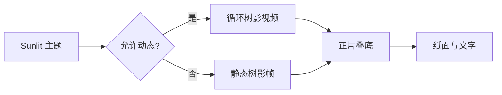

# 在树影下写作

午后的光从窗外斜斜落进来，枝叶在纸面上缓慢移动。这个主题需要让自然光被感知，同时确保正文、插入光标和选择状态始终清楚。

## 正文与强调

Sunlit 面向长时间阅读与写作。这里同时测试 **粗体文字**、*斜体文字*、~~删除内容~~、`行内代码`、[链接](https://typora.io/) 和 ==高亮文本==。

> 树影是氛围，不是内容。它应该被注意到，但不应该要求注意力。

### 列表与任务

- 暖象牙色纸面
- 带一点橄榄色的正文
- 低频、连续的枝叶运动

1. 检查文字中心区域的对比度。
2. 检查树影经过标题时是否仍然易读。
3. 检查滚动、选字和输入是否顺畅。

- [x] 静态树影降级
- [ ] 替换为具有明确授权的正式素材

## 表格

| 状态 | 树影 | 行为 |
| --- | --- | --- |
| Sunlit 启用 | 视频 | 自动播放、循环、静音 |
| 减少动态 | 静态帧 | 不播放视频 |
| 窗口隐藏 | 暂停 | 返回后继续 |
| 打印或导出 | 无 | 保持正文干净 |

## 代码

```css
#sunlit-leaves-overlay {
  position: fixed;
  inset: 0;
  object-fit: cover;
  mix-blend-mode: multiply;
  pointer-events: none;
}
```

```javascript
const atmosphere = 'sunlight through moving leaves'
console.log(atmosphere)
```

## 数学与图表

光照强度可以简单写成 $I(t)=I_0+\epsilon(t)$，其中 $\epsilon(t)$ 是缓慢变化的小扰动。

$$
L_{final}=L_{paper}\times L_{shadow}
$$



---

最后一段用于检查长文末尾、滚动位置和树影覆盖是否稳定。切换到其他主题后，视频应立即淡出并暂停。
