# Typora 主题统一验收文档

这是一份面向主题开发者的视觉回归基准。应用待测主题后直接打开本文档，依次检查混合编辑、源码模式、专注模式、打字机模式、窄窗口、全屏、打印和 PDF 导出。

> [!IMPORTANT]
> 数学公式、上下标、高亮、Emoji、GitHub 风格警告和图表可能需要在“偏好设置 → Markdown”中启用。某一内容未渲染时，请先确认功能开关和 Typora 版本，再判断是否为主题异常。

建议重点观察：层级是否清楚、文字是否溢出、交互控件是否可见、浅色与深色对比度是否足够、代码和图表是否随容器缩放，以及打印时是否去除了动画和装饰背景。

[toc]

## 1. 标题、段落与分隔

### 三级标题 Heading 3

#### 四级标题 Heading 4

##### 五级标题 Heading 5

###### 六级标题 Heading 6

普通段落用于检查中文、西文、数字与标点混排。Typography should remain readable when English words, `inlineCode`, 1234567890, em dash — and CJK punctuation「同时出现」。

这是一个较长的段落，用于观察正文行高、段间距、最大阅读宽度与两端留白。在窄窗口中，文字应自然换行，不应被侧栏、装饰图层或固定宽度遮挡；在宽窗口中，单行长度也不应大到难以阅读。The quick brown fox jumps over the lazy dog. Pack my box with five dozen liquor jugs.

下面两行之间使用 Markdown 行末反斜杠产生硬换行：\
第二行应紧跟在上一行下方，而不是形成新的段落。

下面使用 HTML 换行。<br>换行后的文字应保持相同段落样式。

Setext 一级标题
================

Setext 二级标题
----------------

上方用于检查 Setext 标题；下方依次使用三种水平分隔线。

---

***

___

## 2. 行内文本与字符

### 2.1 基础强调

| 语法 | 渲染样例 |
| --- | --- |
| 斜体 | *星号斜体*、_下划线斜体_ |
| 粗体 | **星号粗体**、__下划线粗体__ |
| 粗斜体 | ***粗斜体***、___粗斜体___ |
| 删除线 | ~~已删除内容~~ |
| 行内代码 | `const theme = "typora"` |
| 嵌套 | **粗体中有 *斜体* 和 `代码`** |

Typora 扩展：==高亮文本==、H~2~O 下标、x^2^ 上标、Emoji 短码 :smile: :rocket: :+1:，以及直接输入的 Unicode Emoji 😀 🌏 ✨。

### 2.2 转义、实体与空白

反斜杠转义：\*不是斜体\*、\# 不是标题、\[不是链接\]、反斜杠本身 `\`。

HTML 实体：版权 &copy;，小于 &lt;，大于 &gt;，不换行空格 A&nbsp;B，和号 &amp;。

单词中的下划线不应触发强调：`theme_runtime_manager`，正文形式为 theme_runtime_manager。

中日韩与复杂字符：简体中文、繁體中文、日本語、한국어、العربية、עברית、हिन्दी、café、naïve、👨‍👩‍👧‍👦。

## 3. 链接与图片

### 3.1 链接

- [行内链接](https://typora.io/ "Typora 官网标题")
- [仓库内相对链接](./README.md)
- [跳转到代码围栏](#7-代码围栏与语法高亮)
- [引用式链接][typora-support]
- [隐式引用链接][]
- 自动链接：<https://typora.io/>
- 邮件自动链接：<theme@example.com>
- Typora 自动识别 URL：https://support.typora.io/Markdown-Reference/

[typora-support]: https://support.typora.io/ "Typora Support"
[隐式引用链接]: https://support.typora.io/Markdown-Reference/ "Markdown Reference"

### 3.2 图片

本地 Markdown 图片；应保持比例并限制在正文宽度内：


引用式图片：

![引用式主题预览][theme-preview]

连续图片用于检查同行排列、间距或主题自定义画廊效果：


HTML 尺寸图片：


下面故意引用不存在的文件，用于检查图片加载失败状态是否清晰且不会撑破布局：


[theme-preview]: ./geek/preview/overview.jpg "Geek 主题预览"

## 4. 引用、警告框与折叠内容

### 4.1 普通引用

> 一级引用应有清晰的边界、缩进和文字对比度。
>
> 引用内可以包含 **强调**、[链接](https://typora.io/) 和列表：
>
> - 引用中的列表项
> - 第二个列表项
>
> > 二级嵌套引用应与一级引用存在可辨识的层级差异。

### 4.2 GitHub 风格 Alerts

> [!NOTE]
> Note 用于补充即使快速浏览也应留意的信息。

> [!TIP]
> Tip 用于提供能够提高成功率的建议。

> [!IMPORTANT]
> Important 用于呈现完成任务所必需的信息。

> [!WARNING]
> Warning 用于提示需要立即关注的风险。

> [!CAUTION]
> Caution 用于说明某个操作可能带来的负面后果。

### 4.3 HTML 折叠内容

<details>
<summary>点击展开详细内容</summary>
<p>折叠区域内包含 <strong>HTML 强调</strong>、<code>inline code</code> 和普通段落。展开前后不应发生异常跳动或内容溢出。</p>
</details>

## 5. 列表与任务项

### 5.1 无序列表

- 减号列表
  - 第二层
    - 第三层
      - 第四层，用于检查深层缩进
- 包含较长文字的列表项，用于检查窄窗口中多行文字的悬挂缩进是否与第一行文字对齐，而不是与项目符号对齐。

* 星号列表
* 第二项

+ 加号列表
+ 第二项

### 5.2 有序与混合列表

1. 第一项
2. 第二项
   1. 嵌套有序项
   2. 第二个嵌套项
3. 混合内容
   - 嵌套无序项
   - 另一个无序项

从非 1 数字开始：

4. 第四项
5. 第五项

### 5.3 任务列表

- [x] 已完成任务
- [ ] 未完成任务
- [x] 包含 **粗体**、`代码` 和 [链接](https://typora.io/) 的任务
  - [ ] 嵌套任务

## 6. 表格

### 6.1 对齐与行内样式

| 左对齐 | 居中对齐 | 右对齐 | 混合内容 |
| :--- | :---: | ---: | --- |
| Left | Center | 1,234.50 | **粗体** |
| 中文 | 中英文 Mixed | ¥99.00 | *斜体*与~~删除线~~ |
| [链接](https://typora.io/) | `inline code` | -42 | H~2~O 与 x^2^ |

### 6.2 宽表格与长内容

| ID | 名称 | 状态 | 平台 | 模式 | 资源路径 | 备注 |
| --- | --- | --- | --- | --- | --- | --- |
| theme-001 | Unified Theme Validation | Published | macOS / Windows / Linux | Light / Dark / Print | `themes/unified-theme/assets/background-with-a-very-long-filename.webp` | 窄窗口下应出现合理滚动或换行，不应挤压整页布局 |
| theme-002 | 中文主题名称 | Draft | macOS | Source / Focus / Typewriter | `themes/中文路径/资源文件.svg` | 检查中文、代码和表格边框 |

## 7. 代码围栏与语法高亮

检查代码块边框、背景、工具栏、语言标签、行号、选择状态、横向滚动和打印换行。可分别切换“显示行号”和“自动换行长行”选项。

无语言代码块：

```
plain text <tag> & symbol
第二行包含中文、制表符与普通空格
```

JavaScript：

```javascript
class ThemeManager {
  constructor(name = 'unified') {
    this.name = name
    this.enabled = true
  }

  async apply(options = {}) {
    const result = await Promise.resolve({ ...options, ok: true })
    console.info(`[Theme] ${this.name}`, result)
    return result
  }
}

const manager = new ThemeManager()
manager.apply({ mode: 'dark', contrast: 4.5 })
```

HTML：

```html
<!doctype html>
<html lang="zh-CN">
  <head>
    <meta charset="utf-8">
    <title>Theme Test</title>
  </head>
  <body class="theme-test">
    <main aria-label="Markdown preview">Content</main>
  </body>
</html>
```

CSS：

```css
:root {
  --paper: #faf9f6;
  --ink: #242424;
  color-scheme: light dark;
}

@media (prefers-reduced-motion: reduce) {
  *, *::before, *::after {
    animation-duration: 0.01ms !important;
  }
}
```

Shell：

```bash
#!/bin/bash
set -euo pipefail
theme_id="paper-note"
printf 'Validating %s\n' "$theme_id"
./theme-scaffold.sh publish "$theme_id"
```

JSON：

```json
{
  "theme": "unified",
  "variants": ["light", "dark"],
  "features": {
    "math": true,
    "diagrams": true
  }
}
```

Diff：

```diff
- --theme-accent: #777777;
+ --theme-accent: #2868c7;
```

超长代码行用于检查换行或横向滚动：

```text
https://example.com/a/very/long/path/that/continues/without/natural/breakpoints/and/should/not/force/the-entire-editor-to-overflow?theme=typora&mode=validation&viewport=narrow
```

## 8. 数学公式

行内公式应与基线对齐：$E = mc^2$，以及 $\lim_{x \to \infty} \frac{1}{x} = 0$。

独立公式：

$$
\int_{-\infty}^{\infty} e^{-x^2}\,dx = \sqrt{\pi}
$$

矩阵与多行公式：

$$
\mathbf{V}_1 \times \mathbf{V}_2 =
\begin{vmatrix}
\mathbf{i} & \mathbf{j} & \mathbf{k} \\
\frac{\partial X}{\partial u} & \frac{\partial Y}{\partial u} & 0 \\
\frac{\partial X}{\partial v} & \frac{\partial Y}{\partial v} & 0
\end{vmatrix}
$$

带编号风格的对齐公式：

$$
\begin{aligned}
(a+b)^2 &= a^2 + 2ab + b^2 \\
(a-b)^2 &= a^2 - 2ab + b^2
\end{aligned}
$$

## 9. 图表

图表功能需要在 Typora 偏好设置中启用。所有图表都应限制在正文宽度内，并在浅色、深色和打印模式下保持文字与连线可读。

### 9.1 Sequence 独立语法

```sequence
Developer->Typora: Apply theme
Typora-->Developer: Render document
Note right of Developer: Inspect visual states
Developer->Typora: Export PDF
```

### 9.2 Flowchart 独立语法

```flow
start=>start: Start
apply=>operation: Apply theme
check=>condition: Looks correct?
fix=>operation: Refine CSS
done=>end: Complete

start->apply->check
check(yes)->done
check(no)->fix->check
```

### 9.3 Mermaid Flowchart

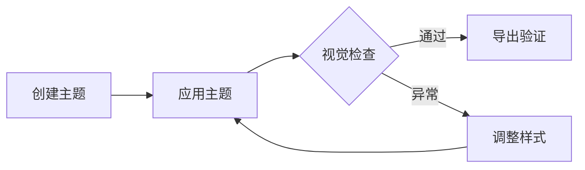

### 9.4 Mermaid Sequence

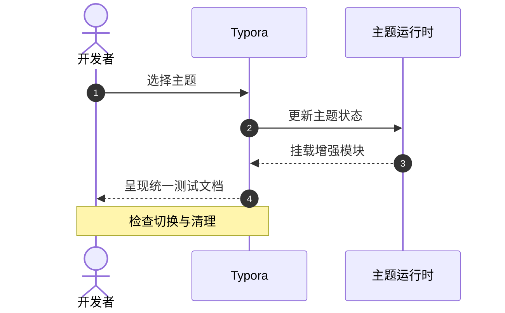

### 9.5 Mermaid Class

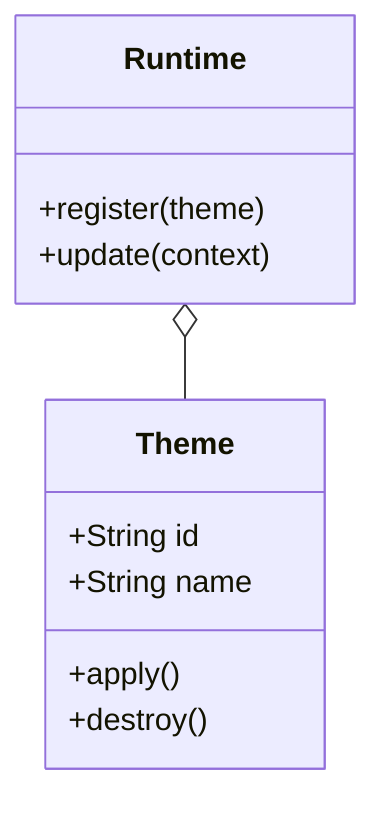

### 9.6 Mermaid State

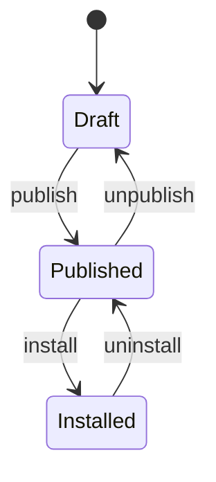

### 9.7 Mermaid Gantt

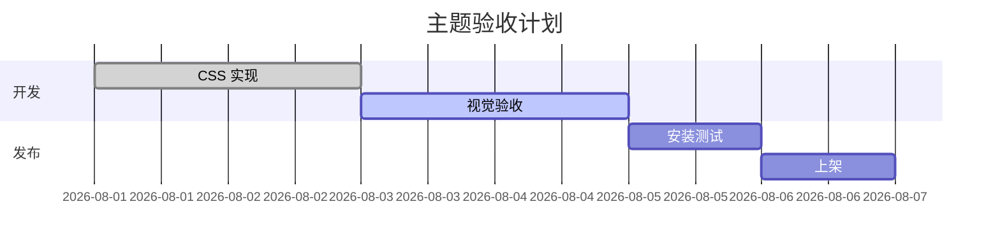

### 9.8 Mermaid Pie

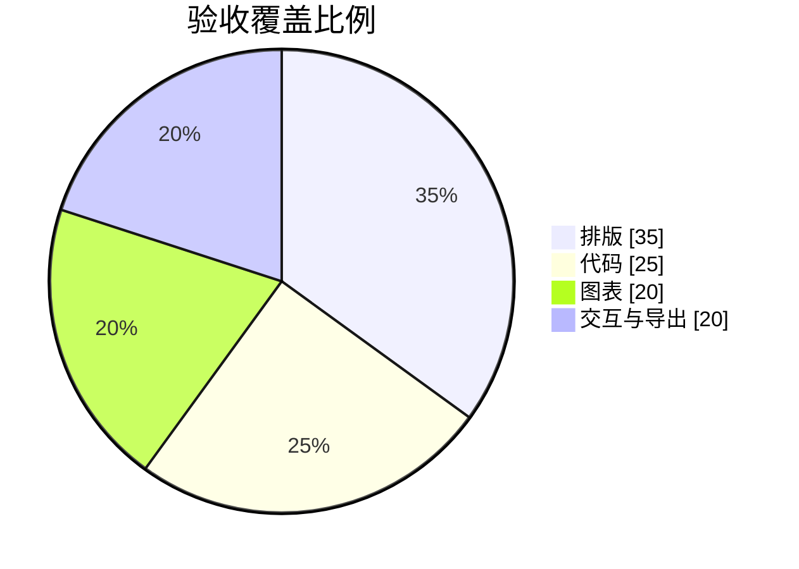

### 9.9 Mermaid Requirement

> [!WARNING]
> Typora 1.14.8（Build 7784）可能无法完成 Requirement Diagram 渲染，并持续显示 `Painting Diagram...`。下列示例已通过 Mermaid 11.13.0 独立解析与渲染验证；若仅此图异常，请视为 Typora 的已知兼容性问题，不计入主题样式验收结果。

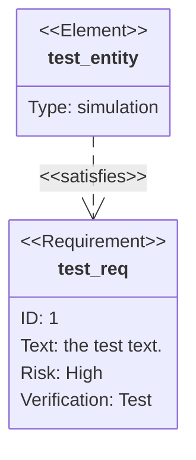

### 9.10 Mermaid Git Graph

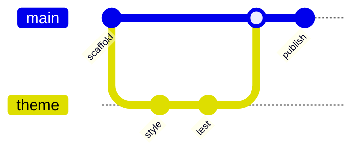

### 9.11 Mermaid Mindmap

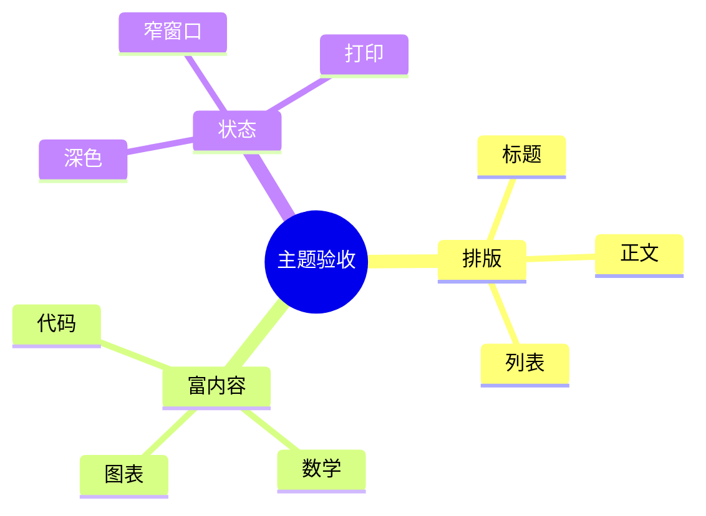

### 9.12 Mermaid Timeline

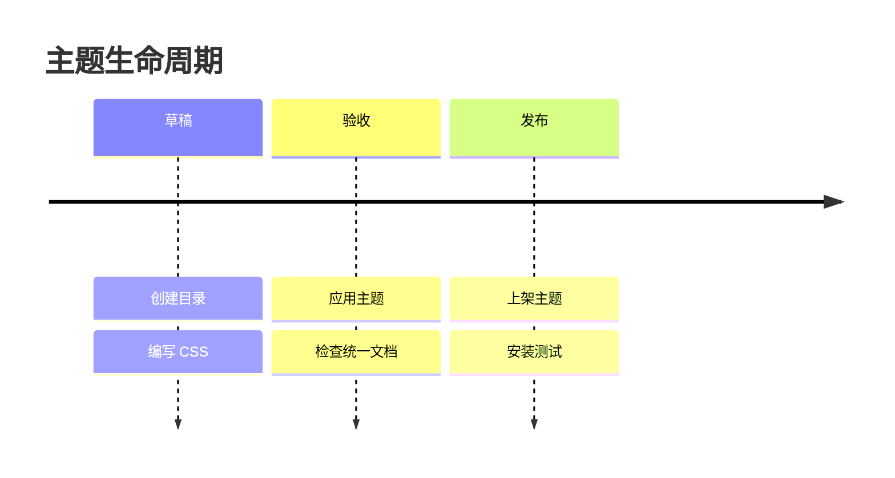

### 9.13 Mermaid Quadrant

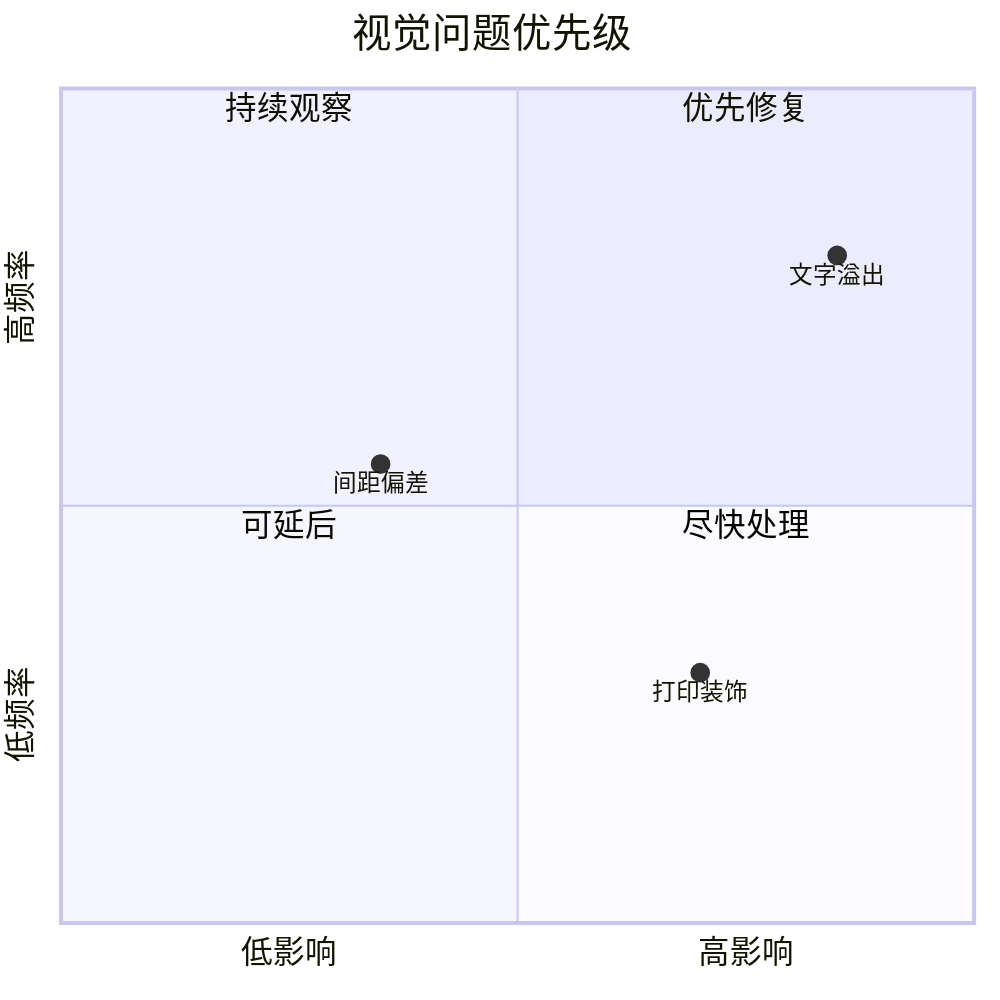

### 9.14 Mermaid XY Chart

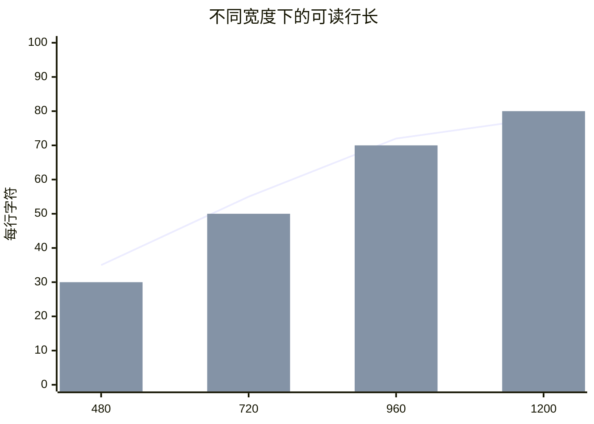

## 10. 脚注

这是一个普通脚注引用。[^basic] 同一句中再放置一个包含行内格式的脚注。[^formatted]

脚注编号、悬浮提示、跳转链接和文末脚注区域都需要检查。重复引用同一个脚注：[^basic]

[^basic]: 普通脚注内容，用于检查字号、边界、间距和返回链接。
[^formatted]: 脚注可以包含 **粗体**、*斜体*、`inline code` 和 [链接](https://typora.io/)。

## 11. HTML 与媒体

### 11.1 行内 HTML

<u>下划线文本</u>、<mark>HTML 标记高亮</mark>、<del>HTML 删除</del>、<ins>HTML 插入</ins>、<small>小号文本</small>、快捷键 <kbd>⌘</kbd> + <kbd>/</kbd>、缩写 <abbr title="Cascading Style Sheets">CSS</abbr>。

颜色只用于确认 HTML `style` 属性没有被主题意外覆盖：<span style="color: #c23b3b;">红色文字</span> 与 <span style="background: #fff2a8; color: #24211d;">带背景文字</span>。

### 11.2 块级 HTML

<div style="border: 1px solid currentColor; border-radius: 8px; padding: 12px;">
  <strong>HTML 容器</strong>
  <p>容器应遵循正文宽度，不应覆盖编辑区域或阻断后续内容。</p>
</div>

### 11.3 视频、音频与内嵌框架

本地视频应显示播放器控件；打印时应隐藏或安全降级：

<video controls width="480" src="./sunlit/sunlit/assets/leaves.mp4"></video>

内嵌的短静音 WAV 只用于检查音频控件布局：

<audio controls src="data:audio/wav;base64,UklGRiQAAABXQVZFZm10IBAAAAABAAEAQB8AAEAfAAABAAgAZGF0YQAAAAA="></audio>

空白沙箱框架用于检查 iframe 边界和宽度，不访问网络：

<iframe title="Typora theme iframe test" src="about:blank" width="100%" height="100"></iframe>

## 12. 边界与溢出

### 12.1 超长连续内容

正文中的连续长字符串：ABCDEFGHIJKLMNOPQRSTUVWXYZabcdefghijklmnopqrstuvwxyz0123456789ABCDEFGHIJKLMNOPQRSTUVWXYZabcdefghijklmnopqrstuvwxyz0123456789。

长 URL：<https://example.com/themes/a-very-long-directory-name/assets/an-even-longer-resource-name-that-must-not-break-the-editor-layout.webp?variant=dark&viewport=compact&language=zh-CN>

### 12.2 大段文本

主题不仅要在短示例中漂亮，也要在真实阅读长度下保持节奏。设计系统中的字号、行高、段间距和内容宽度彼此关联：字号增大时，理想行长通常需要相应收窄；行高不足会让多行中文显得拥挤，行高过大则会切断段落内部的连续感。请在专注模式和打字机模式下滚动这一段，观察当前行、相邻段落、选区与光标是否仍然清楚。同时缩窄窗口，确认长单词、链接、表格、代码块和媒体不会让整个编辑器产生非预期的横向滚动。

The same theme must handle long-form English without producing an excessively wide measure or uneven vertical rhythm. Inspect kerning, punctuation, bold weight, italic distinction, link contrast, text selection, caret visibility, and wrapping around inline code. A robust theme should remain calm when the document becomes dense and should preserve a clear relationship between headings, paragraphs, lists, figures, captions, and footnotes.

## 13. 人工验收清单

- [ ] 六级标题、Setext 标题、正文、软硬换行和分隔线层级正常。
- [ ] 强调、删除线、代码、高亮、上下标、Emoji 与复杂字符可读。
- [ ] 链接、锚点、图片、失败图片和 HTML 尺寸图片表现正常。
- [ ] 引用、五种 Alerts、四层列表、任务项和折叠内容层级清晰。
- [ ] 窄窗口下宽表格与长代码可滚动或合理换行，页面本身不溢出。
- [ ] 代码语法颜色对比度足够，行号、语言标签和工具栏不遮挡内容。
- [ ] 行内与块级数学公式完整，没有裁切或异常背景。
- [ ] Sequence、Flowchart 和 Mermaid 图表文字、节点、连线与背景可读。
- [ ] 视频、音频、iframe 和块级 HTML 不超出正文容器。
- [ ] 混合编辑与源码模式下 Markdown 标记、光标、选区和搜索结果可见。
- [ ] 专注模式、打字机模式、全屏和窄窗口没有布局跳动或遮挡。
- [ ] 浅色、深色主题均有足够对比度，并尊重“减少动态”设置。
- [ ] 打印与 PDF 导出隐藏动态媒体和纯装饰内容，分页、表格与代码可读。
- [ ] 主题增强模块停用或运行时缺失时，文档内容仍完整可编辑。

完成检查后，请记录 Typora 版本、操作系统、主题 ID、浅色/深色变体、窗口尺寸和异常截图，便于后续复现与回归。
